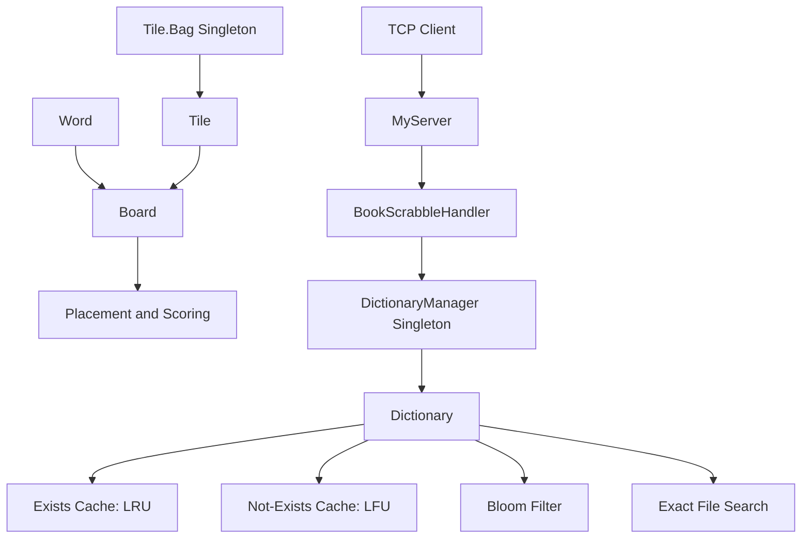

# ScrabbleGame

A Java implementation of a Scrabble-style word game engine, built around board validation, tile management, scoring, dictionary lookup, caching, probabilistic search, file I/O, and TCP client/server communication.

[Play the browser demo](https://masterchiefproject.github.io/ScrabbleGame/) · [Browse the Java source](./src/test)


## Overview

The original project is written in Java and focuses on the underlying game and dictionary infrastructure rather than only the user interface.

It contains two main areas:

1. A 15×15 word-board engine with tile placement, connectivity checks, premium squares, cross-word discovery, and score calculation.
2. A dictionary service with LRU and LFU caching, a Bloom filter, exact file search, a dictionary manager, and a threaded TCP server.

The repository now also contains a browser-playable adaptation under [`docs/`](./docs). The web version is intentionally separate from the original Java implementation so the Java source remains preserved while visitors can immediately interact with the project.

## Live browser demo

The browser version can be hosted directly with GitHub Pages:

https://masterchiefproject.github.io/ScrabbleGame/

The demo includes:

- 15×15 interactive board
- 98-tile letter bag based on the Java `Tile.Bag` implementation
- Seven-tile player rack
- Original letter values
- Premium-square board layout
- First-move center requirement
- Existing-tile reuse
- Connected-word placement rules
- Cross-word scoring
- Rack shuffling and exchange
- Running score, bag count, and turn history
- Responsive layout with no external JavaScript libraries

The browser demo is a JavaScript adaptation for GitHub Pages. It does not run the JVM implementation inside the browser.

Dictionary enforcement is intentionally disabled in the web demo. The original dictionary subsystem is designed around local file corpora and a TCP service, which are documented below.

## Java architecture



## Core components

| Component | Responsibility |
| --- | --- |
| `Board.java` | Maintains the 15×15 board, validates placement, detects connected words, applies premium squares, calculates scores, and commits tiles. |
| `Tile.java` | Represents an immutable letter tile and its score. Contains the singleton `Tile.Bag` implementation. |
| `Word.java` | Represents a sequence of tiles with row, column, and orientation metadata. |
| `Dictionary.java` | Coordinates positive and negative caches, Bloom-filter queries, and exact file challenges. |
| `DictionaryManager.java` | Lazily creates and reuses dictionaries for one or more source files. |
| `CacheManager.java` | Bounded cache abstraction driven by a replacement policy. |
| `LRU.java` | Least Recently Used replacement policy for words known to exist. |
| `LFU.java` | Least Frequently Used replacement policy for words known not to exist. |
| `BloomFilter.java` | Probabilistic membership filter using multiple message digests. |
| `IOSearcher.java` | Performs exact word lookup across dictionary files. |
| `MyServer.java` | Runs the TCP listener on a background thread and dispatches client connections. |
| `BookScrabbleHandler.java` | Parses dictionary query/challenge requests and returns boolean results to the client. |

## Board engine

### Board model

`Board` is implemented as a singleton and owns a 15×15 matrix of `Tile` references.

The placement engine checks:

- Board boundaries
- Occupied positions
- Maximum number of newly supplied tiles
- Empty-word input
- Connection to the existing board
- First-word interaction with the center star
- Reuse of existing board positions through `_` placeholders in the original Java API
- Main-word and perpendicular cross-word construction

`tryPlaceWord()` returns the score awarded for a valid placement and returns `0` when the placement is rejected.

### Premium squares

The Java board contains the following premium types:

- `DLS`, Double Letter Score
- `TLS`, Triple Letter Score
- `DWS`, Double Word Score
- `TWS`, Triple Word Score
- `STAR`, center square

The web adaptation reproduces the board layout and presents these as DL, TL, DW, TW, and the center star.

## Tile bag

`Tile.Bag` is also implemented as a singleton.

The bag contains 98 letter tiles across A to Z. The distribution and score values are encoded directly in `Tile.java`.

Examples:

| Letter | Quantity | Score |
| --- | ---: | ---: |
| A | 9 | 1 |
| E | 12 | 1 |
| J | 1 | 8 |
| Q | 1 | 10 |
| X | 1 | 8 |
| Z | 1 | 10 |

The bag supports random draws, requested-letter draws, returning tiles, quantity inspection, and total-size inspection.

## Dictionary subsystem

The dictionary layer is designed to avoid unnecessary disk searches.

Each `Dictionary` owns:

- A 400-entry positive cache using LRU replacement
- A 100-entry negative cache using LFU replacement
- A 256-bit Bloom filter
- MD5 and SHA-1 message digests for Bloom-filter positions
- One or more backing text files for exact lookup

### Query flow

```text
query(word)
    |
    +-> Positive cache hit? -> true
    |
    +-> Negative cache hit? -> false
    |
    +-> Bloom filter
          |
          +-> probably present -> positive cache -> true
          |
          +-> absent -> negative cache -> false
```

A Bloom-filter hit is probabilistic, so the project also implements `challenge(word)` for exact file-based verification.

### Challenge flow

```text
challenge(word)
    |
    +-> IOSearcher scans the configured files
    |
    +-> Exact result updates the corresponding cache
```

## TCP dictionary service

`MyServer` opens a `ServerSocket` and accepts connections on a background thread. Each accepted socket is passed to a `ClientHandler`.

`BookScrabbleHandler` supports two request types:

```text
Q,file1,file2,...,word
```

Runs a normal dictionary query.

```text
C,file1,file2,...,word
```

Runs an exact dictionary challenge.

The server returns `true` or `false` to the client.

This part of the project demonstrates:

- Java sockets
- Background threads
- Stream handling
- Request parsing
- Service separation
- Shared dictionary management

## Cache strategies

### LRU

The positive cache uses Least Recently Used replacement. Reusing a word moves it to the most-recent position, and eviction removes the oldest entry.

### LFU

The negative cache uses Least Frequently Used replacement. Each access increments a word's usage counter, and eviction removes the entry with the lowest count.

Using different policies for positive and negative lookups demonstrates that cache behavior can be selected according to the workload rather than using one policy globally.

## Bloom filter

`BloomFilter` uses a Java `BitSet` and multiple `MessageDigest` algorithms.

For every inserted word:

1. Each digest hashes the word.
2. The hash is converted to an integer.
3. The integer is mapped into the bit-vector range.
4. The corresponding bit is enabled.

A query returns `false` as soon as one required bit is absent. If every required bit is present, the word is treated as probably present and can be verified with the exact challenge path when required.

## Test harnesses

The repository preserves three coursework test harness snapshots:

| Harness | Main coverage |
| --- | --- |
| `MainTrain1.java` | Tile bag, board legality, placement, connected words, and scoring. |
| `MainTrain2.java` | LRU, LFU, cache manager, Bloom filter, exact file search, and dictionary behavior. |
| `MainTrain3.java` | TCP server lifecycle, dictionary manager, and `BookScrabbleHandler`. |

The files are retained in their original project form and each declares a public class named `MainTrain`. Because Java requires a public class name to match the filename, run one harness at a time after copying the desired harness to `MainTrain.java`, while excluding the three snapshot files from that compilation.

## Browser adaptation

The live version under `docs/` is designed as a portfolio layer on top of the original project.

```text
docs/
├── index.html
├── style.css
├── app.js
└── .nojekyll
```

It uses only HTML, CSS, and JavaScript, so GitHub Pages can host it without a backend.

The Java implementation remains the authoritative source for the original academic project. The browser version focuses on making the board mechanics immediately accessible to a visitor.

### Run the browser version locally

From the repository root:

```bash
cd docs
python -m http.server 8000
```

Then open:

```text
http://localhost:8000
```

## Repository structure

```text
ScrabbleGame/
├── README.md
├── src/
│   ├── test/
│   │   ├── Board.java
│   │   ├── Tile.java
│   │   ├── Word.java
│   │   ├── Dictionary.java
│   │   ├── DictionaryManager.java
│   │   ├── BloomFilter.java
│   │   ├── CacheManager.java
│   │   ├── LRU.java
│   │   ├── LFU.java
│   │   ├── MyServer.java
│   │   ├── BookScrabbleHandler.java
│   │   └── ...
│   └── Project milestone PDFs
└── docs/
    ├── index.html
    ├── style.css
    ├── app.js
    └── .nojekyll
```

## Engineering concepts demonstrated

- Object-oriented design
- Singleton pattern
- Board and grid algorithms
- Word placement validation
- Cross-word discovery
- Score calculation
- Data structures
- Cache replacement policies
- Bloom filters and probabilistic lookup
- Cryptographic hash APIs
- File I/O
- TCP sockets
- Multithreading
- Client/server request handling
- Separation of game and dictionary responsibilities
- Browser adaptation of a JVM project

## Implementation notes

The repository intentionally preserves the original Java source rather than rewriting it to match the browser demo.

`Board.dictionaryLegal()` currently returns `true`, while the richer dictionary implementation exists as a separate subsystem. The browser demo therefore focuses on placement and scoring mechanics and does not claim to provide full dictionary enforcement.

The browser version uses conventional interactive placement behavior rather than reproducing every internal Java API detail byte for byte.

## Project documents

The original project milestone documents are preserved under [`src/`](./src) as part of the project history.

## Disclaimer

This is an educational software project. Scrabble and related trademarks belong to their respective owners. This repository is not affiliated with or endorsed by those trademark owners.
